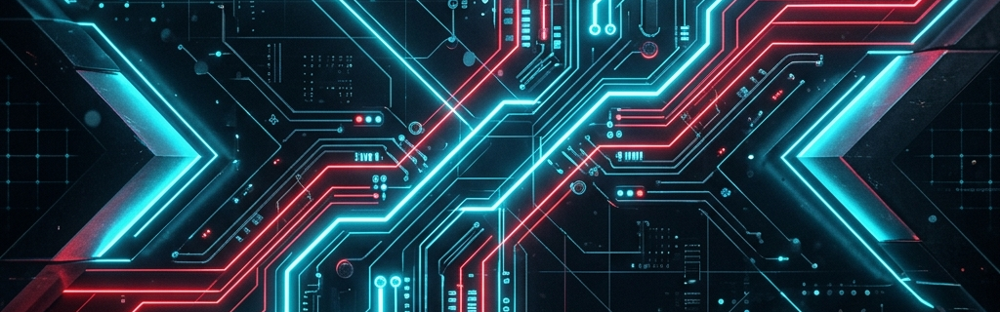

  

---

<table>
  <tr>
    <td valign="top" width="50%">
      <h3>⚡ About Me</h3>
      
I'm a passionate multi-stack developer and cloud architect dedicated to building secure, automated, and high-performance full-stack tools. I love tackling complex backend systems, developing interactive solutions, and engineering custom bypass methods.

      <ul>
        <li>🧠 Founder of <strong>Xenitronix</strong> & <strong>Vexanode</strong></li>
        <li>🛡️ Creator of <strong>Gitguard</strong> (Discord Security Bot)</li>
        <li>🧙 Advanced UID Bypass & FF Panel Developer</li>
        <li>🚀 Specializing in automation, APIs, and cloud infrastructure</li>
      </ul>
    </td>
    <td valign="top" width="50%">
      <h3>🛠️ Quick Info</h3>
      <ul>
        <li>💼 <strong>Current Focus:</strong> Cloud architecture & security automation</li>
        <li>💬 <strong>Ask me about:</strong> Node.js, Python, & bot orchestration</li>
        <li>📫 <strong>Discord:</strong> <a href="https://discord.gg/fzbmhzgU">Join my server</a></li>
        <li>🌐 <strong>Web:</strong> <a href="https://sahilneverdies.github.io/Portfolio/">Portfolio website</a></li>
      </ul>
    </td>
  </tr>
</table>

#

 # 
#

---

## 🛠️ Languages & Tools

<h3 align="center">Programming Languages</h3>

  &nbsp;
  &nbsp;
  &nbsp;
  &nbsp;
  &nbsp;
  &nbsp;
  &nbsp;
  

<h3 align="center">Backend, Infrastructure & Tools</h3>

  &nbsp;
  &nbsp;
  &nbsp;
  &nbsp;
  

---

## 💡 Featured Projects & Creations

| Project | Description | Tech Stack | Link |
| :--- | :--- | :--- | :--- |
| **Gitguard** 🛡️ | Advanced Discord protection and repository guard bot | `Node.js` `Discord.js` | [Authorize Bot](https://discord.com/oauth2/authorize?client_id=1441459969382940844&permissions=2113268958&scope=bot) |
| **Rust UID Bypass** 🧙 | Premium memory bypass and execution system | `Rust` `C++` | *Closed Source* |
| **Miyuki Music** 🎵 | High-fidelity, low-latency Discord music engine | `Node.js` `Lavalink` | [Join Discord Server](https://discord.gg/fzbmhzgU) |
| **Xeni Code** 🧩 | Developer tools suite and code optimization APIs | `Python` `FastAPI` | [Team Page](https://team.danink.cloud/aps) |

---

## 📊 GitHub Stats & Trophies

  
  

  

  

---

## 🎮 Contribution Activity

  

---

## 🔗 Connect with Me

  &nbsp;&nbsp;
  &nbsp;&nbsp;
  

